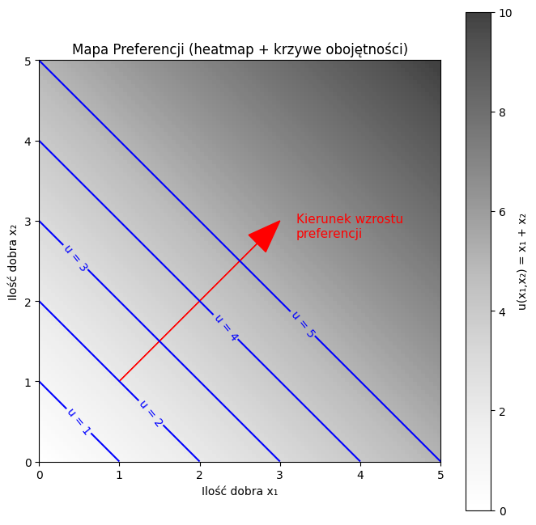
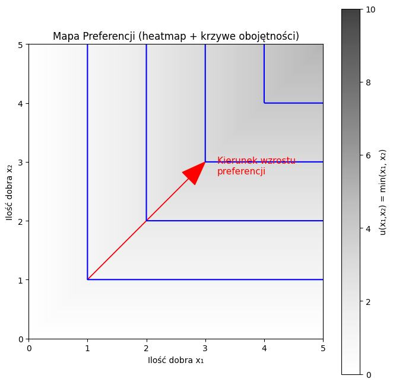
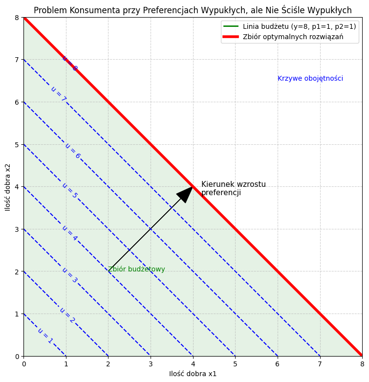
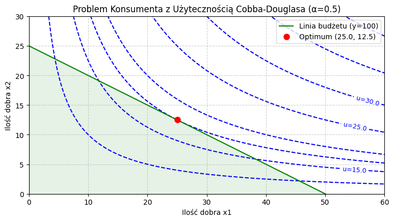
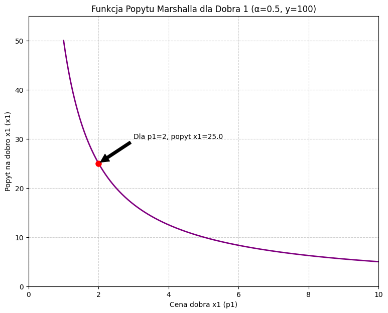
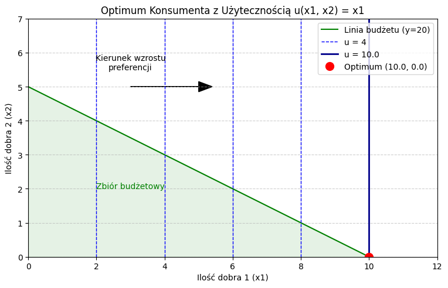
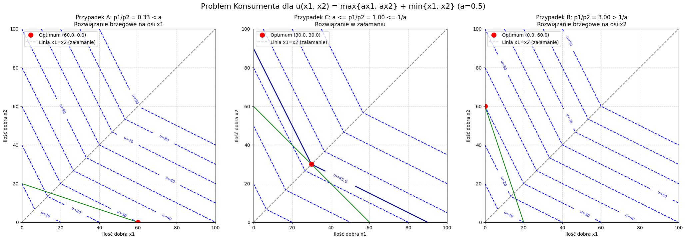

# Zadania domowe 1

## Zadanie 1.4

### Treść 

Udowodnij, że jeżeli $\succeq$ jest relacja preferencji, to relacje $\succ$ (ścisłej preferencji) oraz $\sim$ (obojętności) są przechodnie. 
Wykaż również, ze jeżeli $x^1 \sim x^2 \succeq x^3$ to $x^1 \succeq x^3$

### Rożwiązanie

#### Ścisła preferencja

Chcemy udowodnić, że  jeśli $x^1 \succ x^2$ oraz $x^2 \succ x^3$, to $x^1 \succ x^3$.

##### Rozpisanie ścisłej preferencji jako kombinacji preferencji

$x^1 \succ x^3 \iff (x^1 \succeq x^3 \text{ oraz } \neg(x^3 \succeq x^1))$

oraz

$x^1 \succ x^2 \iff (x^1 \succeq x^2 \text{ oraz } \neg(x^2 \succeq x^1))$

$x^2 \succ x^3 \iff (x^2 \succeq x^3 \text{ oraz } \neg(x^3 \succeq x^2))$

##### Dowód pierwszej części tezy ($x^1 \succeq x^3$):

Z założeń: $x^1 \succeq x^2$ oraz $x^2 \succeq x^3$.

Stąd na mocy **Aksjomatu Przechodniości** dla relacji $\succeq$ wynika, że $x^1 \succeq x^3$.

##### Dowód drugiej części tezy ($\neg(x^3 \succeq x^1)$):

(Dowód nie wprost) Zakładamy, że: $x^3 \succeq x^1$.

Z założeń: $x^1 \succeq x^2$.

Z $x^3 \succeq x^1$ oraz $x^1 \succeq x^2$ na mocy **Aksjomatu Przechodniości** otrzymalibyśmy $x^3 \succeq x^2$.

Jest to sprzeczne z naszym pierwotnym założeniem, że $x^2 \succ x^3$, które implikuje $\neg(x^3 \succeq x^2)$.

---

#### Obojętność

Chcemy udowodnić, że  jeśli $x^1 \sim x^2$ oraz $x^2 \sim x^3$, to $x^1 \sim x^3$.

##### Rozpisanie obojętności jako kombinacji preferencji

$x^1 \succ x^3 \iff (x^1 \succeq x^3 \text{ oraz } x^3 \succeq x^1)$

oraz

$x^1 \sim x^2 \iff (x^1 \succeq x^2 \text{ oraz } x^2 \succeq x^1)$

$x^2 \succ x^3 \iff (x^2 \succeq x^3 \text{ oraz } x^3 \succeq x^2)$

##### Dowód pierwszej części tezy ($x^1 \succeq x^3$):

Z założeń: $x^1 \succeq x^2$ oraz $x^2 \succeq x^3$.

Na mocy **Aksjomatu Przechodniości** dla relacji $\succeq$, wynika z tego, że $x^1 \succeq x^3$.

##### Dowód drugiej części tezy ($x^3 \succeq x^1$):

Z założeń: $x^3 \succeq x^2$ oraz $x^2 \succeq x^1$.

Na mocy **Aksjomatu Przechodniości** dla relacji $\succeq$, wynika z tego, że $x^3 \succeq x^1$.

---

#### Jeżeli $x^1 \sim x^2 \succeq x^3$ to $x^1 \succeq x^3$

##### Rozpisanie ścisłej preferencji jako kombinacji preferencji

$x^1 \sim x^2 \iff (x^1 \succeq x^2 \text{ oraz } x^2 \succeq x^1)$.

##### Zastosowanie aksjomatu przechodniości

$x^1 \sim x^2 \iff (x^1 \succeq x^2 \text{ oraz } x^2 \succeq x^1) \implies x^1 \succeq x^2$.

Spełnione są zatem obie przesłanki aksjomatu przechodniości ($x^1 \succeq x^2$ oraz $x^2 \succeq x^3$)

---

## Zadanie 1.5

### Treść 

Jeżeli $\succeq$ jest relacja preferencji udowodnij następujące stwierdzenia dla dowolnego $x^0 \in X$

(a) $\sim(x^0) = \succeq(x^0) \cap \preceq(x^0)$

(b) $\succeq(x^0) = \sim(x^0) \cup \succ(x^0)$

(c) $\sim(x^0) \cap \succ(x^0) = \varnothing $

(d) $\sim(x^0) \cap \prec(x^0) = \varnothing $

(e) $\succ(x^0) \cap \prec(x^0) = \varnothing $

(f) $\succ(x^0) \cap \sim(x^0) \cap \prec(x^0) = \varnothing $

(g) $\succ(x^0) \cup \sim(x^0) \cup \prec(x^0) = X $

### Definicje pomocnicze

**Zbiory preferencji:**
*   $\succeq(x^0) = \{x \in X \mid x \succeq x^0\}$ (zbiór koszyków nie gorszych niż $x^0$)
*   $\preceq(x^0) = \{x \in X \mid x^0 \succeq x\}$ (zbiór koszyków nie lepszych niż $x^0$)
*   $\sim(x^0) = \{x \in X \mid x \sim x^0\}$ (zbiór koszyków obojętnych względem $x^0$)
*   $\succ(x^0) = \{x \in X \mid x \succ x^0\}$ (zbiór koszyków ściśle preferowanych od $x^0$)
*   $\prec(x^0) = \{x \in X \mid x^0 \succ x\}$ (zbiór koszyków gorszych od $x^0$)

### Rozwiązanie

#### (a) $\sim(x^0) = \succeq(x^0) \cap \preceq(x^0)$

Musimy wykazać, że każdy element zbioru po lewej stronie należy do zbioru po prawej stronie i na odwrót.

1.  **Dowód inkluzji $\sim(x^0) \subseteq \succeq(x^0) \cap \preceq(x^0)$:**
    *   Niech $x$ będzie dowolnym elementem zbioru $\sim(x^0)$.
    *   Z definicji tego zbioru oznacza to, że $x \sim x^0$.
    *   Z definicji relacji obojętności ($\sim$): $(x \succeq x^0 \text{ oraz } x^0 \succeq x)$.
    *   $x \succeq x^0 \implies x \in \succeq(x^0)$.
    *   $x^0 \succeq x \implies x \in \preceq(x^0)$.
    *   Skoro $x$ należy do obu tych zbiorów, to z definicji iloczynu zbiorów $x \in \succeq(x^0) \cap \preceq(x^0)$.

2.  **Dowód inkluzji $\succeq(x^0) \cap \preceq(x^0) \subseteq \sim(x^0)$:**
    *   Niech $x$ będzie dowolnym elementem zbioru $\succeq(x^0) \cap \preceq(x^0)$.
    *   Z definicji iloczynu zbiorów oznacza to, że ($x \in \succeq(x^0)$ oraz $x \in \preceq(x^0)$).
    *   Z definicji tych zbiorów wynika, że ($x \succeq x^0$ oraz $x^0 \succeq x$).
    *   Z definicji relacji obojętności ($\sim$) wynika, że $x \sim x^0$.
    *   Zatem, z definicji zbioru $\sim(x^0)$, $x \in \sim(x^0)$.

Ponieważ obie inkluzje są prawdziwe, zbiory są sobie równe.

#### (b) $\succeq(x^0) = \sim(x^0) \cup \succ(x^0)$

1.  **Dowód inkluzji $\succeq(x^0) \subseteq \sim(x^0) \cup \succ(x^0)$:**
    *   Niech $x$ będzie dowolnym elementem zbioru $\succeq(x^0)$, co oznacza, że $x \succeq x^0$.
    *   Na mocy **Aksjomatu Zupełności**, dla pary koszyków $(x, x^0)$ musi zachodzić $x^0 \succeq x$ lub $\neg(x^0 \succeq x)$. Rozważmy oba przypadki:
        *   **Przypadek 1:** Zachodzi $x^0 \succeq x$. Ponieważ wiemy, że $x \succeq x^0$, to z definicji relacji obojętności mamy $x \sim x^0$. Zatem $x \in \sim(x^0)$.
        *   **Przypadek 2:** Zachodzi $\neg(x^0 \succeq x)$. Ponieważ wiemy, że $x \succeq x^0$, to z definicji relacji ścisłej preferencji mamy $x \succ x^0$. Zatem $x \in \succ(x^0)$.
    *   W obu możliwych przypadkach $x$ należy do $\sim(x^0)$ lub do $\succ(x^0)$, co oznacza, że $x \in \sim(x^0) \cup \succ(x^0)$.

2.  **Dowód inkluzji $\sim(x^0) \cup \succ(x^0) \subseteq \succeq(x^0)$:**
    *   Niech $x$ będzie dowolnym elementem zbioru $\sim(x^0) \cup \succ(x^0)$. Oznacza to, że $x \in \sim(x^0)$ lub $x \in \succ(x^0)$.
        *   **Przypadek 1:** $x \in \sim(x^0)$. Z definicji $x \sim x^0$, co implikuje $x \succeq x^0$. Zatem $x \in \succeq(x^0)$.
        *   **Przypadek 2:** $x \in \succ(x^0)$. Z definicji $x \succ x^0$, co implikuje $x \succeq x^0$. Zatem $x \in \succeq(x^0)$.
    *   W obu przypadkach $x \in \succeq(x^0)$.

Ponieważ obie inkluzje są prawdziwe, zbiory są sobie równe.

#### (c) $\sim(x^0) \cap \succ(x^0) = \varnothing $

Dowód nie wprost

*   Załóżmy, że iloczyn (przecięcie) tych zbiorów nie jest pusty, czyli istnieje taki koszyk $x$, że $x \in \sim(x^0) \cap \succ(x^0)$.
*   Oznacza to, że jednocześnie $x \in \sim(x^0)$ oraz $x \in \succ(x^0)$.
*   Z faktu, że $x \in \sim(x^0)$, wynika, że $x \sim x^0$, co z definicji oznacza, że $(x \succeq x^0 \text{ oraz } \mathbf{x^0 \succeq x})$.
*   Z faktu, że $x \in \succ(x^0)$, wynika, że $x \succ x^0$, co z definicji oznacza, że $(x \succeq x^0 \text{ oraz } \mathbf{\neg(x^0 \succeq x)})$.
*   Otrzymaliśmy sprzeczność logiczną: stwierdzenie $x^0 \succeq x$ musi być jednocześnie prawdziwe i fałszywe.
*   Nasze początkowe założenie musi być zatem błędne - iloczyn zbiorów jest pusty.

#### (d) $\sim(x^0) \cap \prec(x^0) = \varnothing $

Dowód nie wprost (analogicznie do c)

*   Załóżmy, że istnieje taki koszyk $x$, że $x \in \sim(x^0) \cap \prec(x^0)$.
*   Oznacza to, że jednocześnie $x \in \sim(x^0)$ oraz $x \in \prec(x^0)$.
*   Z faktu, że $x \in \sim(x^0)$, wynika, że $x \sim x^0$, co z definicji oznacza, że $(\mathbf{x \succeq x^0} \text{ oraz } x^0 \succeq x)$.
*   Z faktu, że $x \in \prec(x^0)$, wynika, że $x \prec x^0$, co z definicji oznacza, że $(x^0 \succeq x \text{ oraz } \mathbf{\neg(x \succeq x^0)})$.
*   Otrzymaliśmy sprzeczność logiczną: stwierdzenie $x \succeq x^0$ musi być jednocześnie prawdziwe i fałszywe.
*   Wnioskujemy, że iloczyn zbiorów jest pusty.

#### (e) $\succ(x^0) \cap \prec(x^0) = \varnothing $

Dowód nie wprost (analogicznie do c i d)

*   Załóżmy, że istnieje taki koszyk $x$, że $x \in \succ(x^0) \cap \prec(x^0)$.
*   Oznacza to, że jednocześnie $x \in \succ(x^0)$ oraz $x \in \prec(x^0)$.
*   Z faktu, że $x \in \succ(x^0)$, wynika, że $x \succ x^0$, co z definicji oznacza, że $(\mathbf{x \succeq x^0} \text{ oraz } \neg(x^0 \succeq x))$.
*   Z faktu, że $x \in \prec(x^0)$, wynika, że $x \prec x^0$, co z definicji oznacza, że $(x^0 \succeq x \text{ oraz } \mathbf{\neg(x \succeq x^0)})$.
*   Otrzymaliśmy sprzeczność logiczną: stwierdzenie $x \succeq x^0$ musi być jednocześnie prawdziwe i fałszywe.
*   Wnioskujemy, że iloczyn zbiorów jest pusty.

#### (f) $\succ(x^0) \cap \sim(x^0) \cap \prec(x^0) = \varnothing $

Ten dowód wynika bezpośrednio z poprzednich.

*   Iloczyn trzech zbiorów $A \cap B \cap C$ jest podzbiorem iloczynu dowolnych dwóch z nich, np. $(A \cap B \cap C) \subseteq (A \cap B)$.
*   Zatem $\succ(x^0) \cap \sim(x^0) \cap \prec(x^0) \subseteq \succ(x^0) \cap \sim(x^0)$.
*   W punkcie (c) udowodniliśmy, że $\succ(x^0) \cap \sim(x^0) = \varnothing$.
*   Ponieważ nasz zbiór jest podzbiorem zbioru pustego, sam musi być zbiorem pustym.

#### (g) $\succ(x^0) \cup \sim(x^0) \cup \prec(x^0) = X $

*   Niech $x$ będzie dowolnym elementem zbioru $X$.
*   Na mocy **Aksjomatu Zupełności**, porównując $x$ i $x^0$, musi zachodzić co najmniej jedna z relacji: $x \succeq x^0$ lub $x^0 \succeq x$.
*   Rozważmy wszystkie logiczne możliwości:
    1.  **Zachodzi $x \succeq x^0$ ORAZ $x^0 \succeq x$:** Z definicji relacji obojętności, $x \sim x^0$. Zatem $x \in \sim(x^0)$.
    2.  **Zachodzi $x \succeq x^0$, ALE NIE zachodzi $x^0 \succeq x$ (czyli $\neg(x^0 \succeq x)$):** Z definicji relacji ścisłej preferencji, $x \succ x^0$. Zatem $x \in \succ(x^0)$.
    3.  **Zachodzi $x^0 \succeq x$, ALE NIE zachodzi $x \succeq x^0$ (czyli $\neg(x \succeq x^0)$):** Z definicji relacji ścisłej preferencji, $x^0 \succ x$, co jest równoważne z $x \prec x^0$. Zatem $x \in \prec(x^0)$.
*   Aksjomat Zupełności gwarantuje, że dla dowolnego $x \in X$ musi zajść jeden z powyższych trzech przypadków (nie ma innej możliwości).
*   Oznacza to, że każdy element $x \in X$ musi należeć do jednego ze zbiorów: $\sim(x^0)$, $\succ(x^0)$ lub $\prec(x^0)$.
*   Zatem, że suma tych trzech zbiorów jest równa całemu zbiorowi $X$.

---

## Zadanie 1.6

### Treść

Podaj wiarygodny przykład preferencji zwykłego konsumenta, które to preferencje nie spełniają aksjomatu przechodniości.

#### Odpowiedź

Aby zrozumieć, skąd biorą się wiarygodne przypadki nietranzytywności w codziennych wyborach, należy sięgnąć do psychofizyki – dziedziny nauki badającej relacje między obiektywnymi, fizycznymi właściwościami bodźców a subiektywnymi wrażeniami zmysłowymi, jakie one wywołują.  Kluczowym pojęciem w tej dziedzinie jest **ledwo dostrzegalna różnica** (Just-Noticeable Difference, JND), znana również jako próg różnicy.

JND definiuje się jako minimalną zmianę w natężeniu bodźca, która jest wykrywalna przez człowieka w co najmniej 50% przypadków. Nie jest to więc wartość absolutna, lecz miara statystyczna, która odzwierciedla ograniczenia ludzkiej percepcji. Fundamentalne dla zrozumienia JND jest Prawo Webera, sformułowane w XIX wieku przez Ernsta Webera. Głosi ono, że ledwo dostrzegalna różnica dla danego bodźca jest proporcjonalna do jego początkowego natężenia. Można to wyrazić wzorem:

$$\frac{\Delta I}{I} = k$$

gdzie $\Delta I$ to JND, $I$ to początkowe natężenie bodźca, a $k$ to stała Webera, charakterystyczna dla danego zmysłu. W praktyce oznacza to, że znacznie łatwiej jest nam zauważyć różnicę jednego kilograma, gdy porównujemy ciężary o masie 2 kg i 3 kg, niż gdy porównujemy obiekty ważące 50 kg i 51 kg. Nasze zmysły są wyspecjalizowane w wykrywaniu względnych, a nie absolutnych zmian.

Zjawisko JND ma bezpośrednie przełożenie na preferencje konsumenckie. Małe, subtelne różnice w cenie, jakości produktu, smaku potrawy czy głośności dźwięku mogą znajdować się poniżej progu naszej percepcji, co prowadzi do oceny danych alternatyw jako obojętnych. Problem pojawia się, gdy seria takich niezauważalnych różnic kumuluje się, prowadząc do paradoksu logicznego, znanego w filozofii jako paradoks stosu (Sorites Paradox). Jeśli usunięcie jednego ziarnka piasku nie sprawia, że stos przestaje być stosem, to w którym momencie, po usunięciu ilu ziaren, stos znika?.

Przenosząc to na grunt teorii wyboru, JND może prowadzić do naruszenia przechodniości, zwłaszcza w odniesieniu do relacji obojętności. Załóżmy, że konsument jest obojętny między opcją A i B ($A \sim B$), ponieważ różnica między nimi jest mniejsza niż JND. Z tego samego powodu jest również obojętny między B i C ($B \sim C$). Aksjomat przechodniości obojętności ($A \sim B \land B \sim C \rightarrow A \sim C$) wymagałby, aby konsument był także obojętny między A i C. Jednakże skumulowana różnica między A i C może już przekraczać próg JND, co prowadzi do wyraźnej, ścisłej preferencji (np. $A \succ C$). Jest to jawne złamanie aksjomatu.

Taka perspektywa pozwala przeformułować problem nietranzytywności. Nie jest ona wynikiem błędu logicznego czy porażki intelektualnej konsumenta, lecz nieuniknioną konsekwencją budowy i funkcjonowania ludzkiego systemu percepcyjnego. Nasze zmysły nie działają jak precyzyjne instrumenty pomiarowe, zdolne do nieskończonej dyskryminacji bodźców. Są to systemy biologiczne, zoptymalizowane do filtrowania nieistotnych informacji ("szumu") i wykrywania znaczących, względnych zmian w otoczeniu. "Irracjonalność" w postaci nietranzytywności pojawia się, gdy do opisu tego biologicznego systemu stosujemy model ekonomiczny, który w swoich założeniach ignoruje jego fundamentalne ograniczenia. Jest to zatem manifestacja biologicznego przymusu w postaci logicznej niespójności.

#### Studium Przypadku: Wybór Sprzętu Elektronicznego w Oparciu o Jakość i Cenę

Aby zilustrować, jak mechanizm JND prowadzi do nietranzytywnych preferencji w typowej sytuacji rynkowej, rozważmy następujący, wiarygodny scenariusz. Konsument, nazwijmy go Jan, planuje zakup nowego telewizora 4K. Dysponuje określonym budżetem, ale jest skłonny do niewielkich dopłat w zamian za zauważalną poprawę jakości. W sklepie z elektroniką sprzedawca prezentuje mu cztery modele tego samego producenta, należące do jednej linii produktowej, różniące się subtelnie parametrami i ceną.

#### Prezentacja Alternatyw

Dostępne opcje zostały przedstawione w poniższej tabeli, która systematyzuje kluczowe atrybuty i ceny porównywanych modeli.

**Tabela 1: Atrybuty i Ceny Porównywanych Modeli Telewizorów**

| Model | Kluczowe Atrybuty (Jakość) | Cena (PLN) | Różnica Ceny (vs. poprzedni) |
| :--- | :--- | :--- | :--- |
| **A** | Rozdzielczość 4K, 60Hz, Standard HDR | 2000 | - |
| **B** | 4K, **100Hz**, Standard HDR | 2200 | +200 |
| **C** | 4K, 100Hz, **Lepszy Kontrast HDR+** | 2400 | +200 |
| **D** | 4K, 100Hz, Lepszy Kontrast HDR+, **Szybszy CPU** | 2600 | +200 |

#### Proces Decyzyjny (Porównania Parami)

Jan, aby dokonać wyboru, porównuje modele parami, zaczynając od najtańszego.

1.  **Porównanie A vs. B:** Jan staje przed wyborem między Modelem A za 2000 zł a Modelem B za 2200 zł. Różnica w cenie, wynosząca 200 zł, wydaje mu się niewielka, wręcz "pomijalna" (negligible). Znajduje się ona poniżej jego progu JND dla ceny. W tej sytuacji jego uwaga skupia się na wymiarze jakości, gdzie Model B oferuje wyraźnie lepsze odświeżanie obrazu (100Hz vs 60Hz). Poprawa ta wydaje się warta niewielkiej dopłaty. **Jego preferencja to: $B \succ A$**.

2.  **Porównanie B vs. C:** Sytuacja powtarza się. Porównując Model B (2200 zł) z Modelem C (2400 zł), Jan ponownie staje w obliczu różnicy cenowej 200 zł, która nie wydaje mu się znacząca. Skupia się więc na kolejnym ulepszeniu – lepszym kontraście w technologii HDR+. Ponownie, lokalna korzyść przeważa nad niewielkim kosztem. **Jego preferencja to: $C \succ B$**.

3.  **Porównanie C vs. D:** Ten sam schemat myślenia utrzymuje się przy ostatniej parze. Różnica 200 zł między Modelem C a D jest postrzegana jako akceptowalna w zamian za szybszy procesor, który poprawia płynność działania systemu Smart TV. **Jego preferencja to: $D \succ C$**.

#### Złamanie Przechodniości

Na podstawie serii powyższych, lokalnie spójnych wyborów, aksjomat przechodniości implikowałby jednoznaczny wniosek. Skoro $D \succ C$, $C \succ B$ i $B \succ A$, to Jan powinien zdecydowanie preferować Model D od Modelu A (formalnie: $D \succ C \succ B \succ A \rightarrow D \succ A$).

#### Ostateczne Porównanie (A vs. D)

Teraz jednak sprzedawca, chcąc pomóc w ostatecznej decyzji, prosi Jana o bezpośrednie porównanie opcji skrajnych: najtańszego Modelu A (2000 zł) z najdroższym Modelem D (2600 zł). W tym momencie perspektywa Jana ulega radykalnej zmianie. Skumulowana różnica w cenie wynosi teraz 600 zł. Ta kwota jest już znacząca i wyraźnie przekracza jego próg obojętności. Różnica w jakości między A i D, choć oczywiście istnieje, nie wydaje mu się już warta aż tak dużej dopłaty. W tym globalnym porównaniu wymiar ceny staje się dominujący. **Jego preferencja ulega odwróceniu: $A \succ D$**.

#### Cykl Preferencji

W rezultacie preferencje Jana tworzą zamknięty, nietranzytywny cykl: **$B \succ A$, $C \succ B$, $D \succ C$, ale $A \succ D$**. Jest to podręcznikowy przykład naruszenia aksjomatu przechodniości, który nie wynika z błędu czy losowości, ale z systematycznego mechanizmu percepcyjnego i poznawczego.

#### Analiza Wielowymiarowa: Gdy Kryteria Decyzyjne Wchodzą w Konflikt

Przykład Jana i wyboru telewizora intuicyjnie pokazuje, jak nietranzytywność może powstać w praktyce. Aby jednak w pełni zrozumieć ten mechanizm, warto sięgnąć po bardziej formalne narzędzia analityczne, rozwinięte przez Amosa Tversky'ego w jego przełomowych pracach nad teorią wyboru. Kluczowe jest tu odejście od jednowymiarowej koncepcji użyteczności na rzecz postrzegania decyzji jako procesu oceny alternatyw wzdłuż wielu, często konkurujących ze sobą, atrybutów lub wymiarów – takich jak cena, jakość, marka, estetyka czy funkcjonalność.

Tversky zaproponował tzw. **model addytywnych różnic**, który zakłada, że konsument nie ocenia "absolutnej" wartości każdej opcji z osobna, ale podejmuje decyzję na podstawie porównania *różnic* między opcjami na poszczególnych wymiarach. W tym ujęciu ocena każdej alternatywy jest względna i zależy od tego, z czym jest ona w danym momencie porównywana.

Centralnym elementem tego modelu, który formalizuje koncepcję JND, jest **próg decyzyjny**, oznaczany jako $\epsilon$ (epsilon). Próg ten definiuje regułę, według której konsument przełącza się między kryteriami decyzyjnymi:
*   **Reguła 1:** Jeśli różnica między dwiema opcjami na najważniejszym dla konsumenta wymiarze (w naszym przykładzie: cena) jest mniejsza lub równa progowi $\epsilon$, konsument uznaje tę różnicę za nieistotną i podejmuje decyzję, opierając się na drugim co do ważności wymiarze (jakość).
*   **Reguła 2:** Jeśli różnica na głównym wymiarze przekracza próg $\epsilon$, staje się ona decydująca i konsument wybiera opcję, która jest lepsza na tym właśnie wymiarze.

Zastosujmy ten model do analizy przypadku Jana. Załóżmy, że jego próg decyzyjny $\epsilon$ dla różnicy w cenie wynosi 500 zł. Oznacza to, że dopóki różnica w cenie nie przekroczy tej kwoty, będzie ją ignorował na rzecz jakości.
*   **Porównanie B vs. A:** Różnica ceny wynosi 200 zł. Ponieważ $200 \text{ zł} < \epsilon$, Jan ignoruje cenę i wybiera na podstawie jakości. Wynik: **$B \succ A$**.
*   **Porównanie C vs. B:** Różnica ceny wynosi 200 zł. Ponieważ $200 \text{ zł} < \epsilon$, Jan ignoruje cenę i wybiera na podstawie jakości. Wynik: **$C \succ B$**.
*   **Porównanie D vs. C:** Różnica ceny wynosi 200 zł. Ponieważ $200 \text{ zł} < \epsilon$, Jan ignoruje cenę i wybiera na podstawie jakości. Wynik: **$D \succ C$**.
*   **Porównanie A vs. D:** Różnica ceny wynosi 600 zł. Ponieważ $600 \text{ zł} > \epsilon$, próg został przekroczony. Różnica w cenie staje się decydująca, a Jan wybiera tańszą opcję. Wynik: **$A \succ D$**.

Model Tversky'ego z niezwykłą precyzją przewiduje obserwowany cykl preferencji. Co więcej, ujawnia on pewien paradoks: nietranzytywność nie jest tu wynikiem chaosu, braku konsekwencji czy irracjonalnego miotania się. Wręcz przeciwnie, jest ona rezultatem *spójnego i metodycznego stosowania* nieliniowej, ale jasno zdefiniowanej reguły decyzyjnej. Jan w każdym pojedynczym kroku zachowuje się w sposób przewidywalny i "lokalnie racjonalny". "Irracjonalność" w postaci nietranzytywnego cyklu pojawia się dopiero na poziomie globalnym, jako emergentna właściwość sumy tych lokalnie spójnych wyborów. To podważa prostą dychotomię "racjonalny kontra irracjonalny" i prowadzi nas w stronę bardziej zniuansowanego pojęcia **ograniczonej racjonalności** (bounded rationality), wprowadzonego przez Herberta Simona. Konsumenci nie są wszechwiedzącymi optymalizatorami, ale używają skutecznych, choć niedoskonałych heurystyk, aby uprościć złożone problemy decyzyjne i oszczędzać zasoby poznawcze. Nietranzytywność jest ceną, jaką płacimy za tę poznawczą efektywność.

### Źrodła

University of Florida - "Reason-Based Choice" by Shafir, Simonson, Tversky - https://bear.warrington.ufl.edu/brenner/mar7588/Papers/shafir-reasonbased-cog1993.pdf 

Verywell Mind - "What Is the Just Noticeable Difference?" - https://www.verywellmind.com/what-is-the-just-noticeable-difference-2795306 

University of California, San Diego - "Intransitivity of Preferences" by Amos Tversky -https://pages.ucsd.edu/~mckenzie/Tversky1969PsychReview.pdf 

---

## Zadanie 1.8

### Treść

Naszkicuj mapę preferencji, na której wszystkie zbiory obojetnosci sq równoległymi,
ujemnie nachylonymi liniami prostymi przy preferencjach rosnących do góry i w prawo.
Wiemy, ze preferencje takie spełniają Aksjomaty 1, 2, 3 oraz 4. Udowodnij, że spełniają
one równiez Aksjomat 5'. Udowodnij, ze nie spełniają Aksjomatu 5

### Rozwiązanie

#### Mapa preferencji

> Kod do przygotowania wykresu (przyjmujący $u(x_1, x_2) = x_1 + x_2$) znajduje się w notebooku [zadania_domowe_01.ipynb](kod/zadania_domowe_01.ipynb)

#### Dowód spełniania aksjomatu 5' (wypukłość)

**Aksjomat 5 (Wypukłość):** Dla każdych $x^1, x^2 \in \mathbb{R}_{+}^{n}$, jeśli $x^1 \succeq x^2$, to dla każdego $t \\in $ zachodzi $tx^1 + (1-t)x^2 \succeq x^2$.

**Dowód:**

1.  **Założenia:**

      * Niech preferencje będą reprezentowane przez liniową funkcję użyteczności $u(x_1, x_2) = a x_1 + b x_2$, gdzie $a, b > 0$.
      * Wybierzmy dwa dowolne koszyki $x^1 = (x_1^1, x_2^1)$ oraz $x^2 = (x_1^2, x_2^2)$.
      * Załóżmy, że $x^1 \succeq x^2$. Zgodnie z definicją funkcji użyteczności oznacza to, że $u(x^1) \ge u(x^2)$.

2.  **Stworzenie kombinacji wypukłej:** Rozważmy dowolną kombinację wypukłą $x^t = tx^1 + (1-t)x^2$ dla $t \in \lt 0, 1 \gt$.

3.  **Sprawdzenie warunku słabej preferencji:** Musimy udowodnić, że $x^t \succeq x^2$, co jest równoważne z udowodnieniem, że $u(x^t) \ge u(x^2)$.

      * Obliczmy użyteczność koszyka $x^t$:
        $u(x^t) = a(t x_1^1 + (1-t) x_1^2) + b(t x_2^1 + (1-t) x_2^2)$

        $u(x^t) = t(a x_1^1 + b x_2^1) + (1-t)(a x_1^2 + b x_2^2)$

        $u(x^t) = t \cdot u(x^1) + (1-t) \cdot u(x^2)$
      * Naszym celem jest pokazanie, że $t \cdot u(x^1) + (1-t) \cdot u(x^2) \ge u(x^2)$.
      * Z naszego pierwotnego założenia wiemy, że $u(x^1) \ge u(x^2)$.
      * Ponieważ $t$ jest liczbą nieujemną ($t \ge 0$), możemy pomnożyć obie strony nierówności przez $t$:

        $t \cdot u(x^1) \ge t \cdot u(x^2)$
      * Dodajmy do obu stron nierówności wyrażenie $(1-t) \cdot u(x^2)$. Ponieważ $t \le 1$, wyrażenie $(1-t)$ jest również nieujemne.

        $t \cdot u(x^1) + (1-t) \cdot u(x^2) \ge t \cdot u(x^2) + (1-t) \cdot u(x^2)$
      * Upraszczając prawą stronę:

        $t \cdot u(x^1) + (1-t) \cdot u(x^2) \ge (t + 1 - t) \cdot u(x^2)$

        $t \cdot u(x^1) + (1-t) \cdot u(x^2) \ge u(x^2)$
      * A ponieważ lewa strona jest równa $u(x^t)$, otrzymujemy:
        $u(x^t) \ge u(x^2)$

#### Dowód niespełniania aksjomatu 5' (ścisła wypukłość)

Aby udowodnić, że aksjomat nie jest spełniony, wystarczy znaleźć jeden przypadek, w którym jego warunki nie zachodzą.

1.  **Wybór koszyków:** Wybierzmy dwa różne koszyki, $x^1$ i $x^2$, które leżą na tej samej krzywej obojętności (linii prostej). Niech naszą funkcją użyteczności będzie $u(x_1, x_2) = x_1 + x_2$.

      * Niech $x^1 = (4, 0)$. Wtedy $u(x^1) = 4 + 0 = 4$.
      * Niech $x^2 = (0, 4)$. Wtedy $u(x^2) = 0 + 4 = 4$.
      * Mamy $x^1 \neq x^2$ oraz $u(x^1) = u(x^2)$, co oznacza, że $x^1 \sim x^2$, a więc warunek $x^1 \succeq x^2$ jest spełniony.

2.  **Stworzenie kombinacji wypukłej:** Weźmy dowolny "uśredniony" koszyk $x^t$ leżący na odcinku między $x^1$ a $x^2$, dla $t \in (0,1)$. Wybierzmy $t = 0.5$.

      * $x^t = 0.5 \cdot x^1 + (1-0.5) \cdot x^2 = 0.5 \cdot (4,0) + 0.5 \cdot (0,4) = (2,2)$.

3.  **Sprawdzenie warunku ścisłej preferencji:** Aksjomat 5' wymaga, aby zachodziła relacja $x^t \succ x^2$. Sprawdźmy, czy tak jest.

      * Relacja $x^t \succ x^2$ jest prawdziwa wtedy i tylko wtedy, gdy $u(x^t) > u(x^2)$.
      * Obliczmy użyteczność dla koszyka $x^t$: $u(x^t) = u(2,2) = 2 + 2 = 4$.
      * Porównajmy użyteczności: $u(x^t) = 4$ oraz $u(x^2) = 4$.
      * Warunek $4 > 4$ jest **fałszywy**. W rzeczywistości zachodzi $u(x^t) = u(x^2)$, co oznacza, że $x^t \sim x^2$.

---

## Zadanie 1.9

### Treść

Naszkicuj mapę preferencji, na której wszystkie zbiory obojetności maja ksztalt litery „L"
o ramionach skierowanych do góry i w prawo oraz o wierzcholkach znajdujacych sie na linii $x_1, x_2$$. Jeżeli preferencje rosna do góry i w prawo, to spełniają one Aksjomaty 1, 2, 3
oraz 4'. Udowodnij, że spełniają one równiez Aksjomat 5'. Czy spełniają Aksjomat 4? Czy
spełniają Aksjomat 5?

### Rozwiązanie

Preferencje, w których krzywe obojętności mają kształt litery "L" z wierzchołkami na linii $x_1 = x_2$, reprezentują **dobra doskonale komplementarne**. Oznacza to, że konsument czerpie użyteczność z konsumpcji tych dóbr tylko w stałej proporcji (w tym przypadku 1:1). Można je opisać za pomocą **funkcji użyteczności Leontiefa**, np. $u(x_1, x_2) = \min(x_1, x_2)$.

#### Mapa preferencji

> Kod do przygotowania wykresu (przyjmujący $u(x_1, x_2) = min(x_1, x_2)$) znajduje się w notebooku [zadania_domowe_01.ipynb](kod/zadania_domowe_01.ipynb)

### Dowód, że preferencje te spełniają Aksjomat 5' (Wypukłość)

**Dowód (ogólny):**
Musimy udowodnić, że funkcja użyteczności $u(x_1, x_2) = \min(x_1, x_2)$ jest **quasi-wklęsła**. Funkcja jest quasi-wklęsła, jeśli dla dowolnych $x^1, x^2$ zachodzi:
$u(tx^1 + (1-t)x^2) \ge \min(u(x^1), u(x^2))$.

1.  **Założenia:**

      * Niech $x^1 = (x_1^1, x_2^1)$ i $x^2 = (x_1^2, x_2^2)$.
      * Niech $u(x^1) = \min(x_1^1, x_2^1)$ i $u(x^2) = \min(x_1^2, x_2^2)$.
      * Z definicji minimum wiemy, że $x_1^1 \ge u(x^1)$ oraz $x_2^1 \ge u(x^1)$. Podobnie $x_1^2 \ge u(x^2)$ oraz $x_2^2 \ge u(x^2)$.

2.  **Analiza kombinacji wypukłej:** Rozważmy koszyk $x^t = tx^1 + (1-t)x^2$. Jego współrzędne to $(tx_1^1 + (1-t)x_1^2, tx_2^1 + (1-t)x_2^2)$.

      * Przeanalizujmy pierwszą współrzędną:
        $tx_1^1 + (1-t)x_1^2 \ge t \cdot u(x^1) + (1-t) \cdot u(x^2)$
        Ponieważ $t \\in $, średnia ważona jest nie mniejsza niż minimum składników, więc:
        $t \cdot u(x^1) + (1-t) \cdot u(x^2) \ge \min(u(x^1), u(x^2))$
        Zatem: $tx_1^1 + (1-t)x_1^2 \ge \min(u(x^1), u(x^2))$.
      * Analogicznie dla drugiej współrzędnej:
        $tx_2^1 + (1-t)x_2^2 \ge \min(u(x^1), u(x^2))$.

3.  **Obliczenie użyteczności $u(x^t)$:**

      * $u(x^t) = \min(tx_1^1 + (1-t)x_1^2, tx_2^1 + (1-t)x_2^2)$.
      * Ponieważ obie współrzędne koszyka $x^t$ są większe lub równe $\min(u(x^1), u(x^2))$, to minimum z tych dwóch współrzędnych również musi być większe lub równe tej wartości.
      * Zatem: $u(x^t) \ge \min(u(x^1), u(x^2))$.

Zatem $u(x^t) \ge u(x^2)$, co oznacza $x^t \succeq x^2$. **Aksjomat 5' (Wypukłość) jest spełniony**.

#### Czy preferencje spełniają Aksjomat 4 (Monotoniczność)?

Aksjomat 4 zakłada, że jeśli mamy więcej *przynajmniej jednego* dobra (i nie mniej żadnego innego), to koszyk jest *ściśle* preferowany. W przypadku dóbr komplementarnych tak nie jest.

1.  **Wybór koszyków:**

      * Niech $x^2 = (4, 4)$. Użyteczność tego koszyka wynosi $u(x^2) = \min(4, 4) = 4$.
      * Niech $x^1 = (4, 6)$. Koszyk ten zawiera tyle samo dobra 1 i więcej dobra 2, więc $x^1 \ge x^2$.

2.  **Sprawdzenie warunku preferencji:**

      * Obliczmy użyteczność koszyka $x^1$: $u(x^1) = \min(4, 6) = 4$.
      * Porównajmy użyteczności: $u(x^1) = 4$ oraz $u(x^2) = 4$.
      * Ponieważ użyteczności są równe, oznacza to, że $x^1 \sim x^2$.

**Wniosek:** Mimo że koszyk $x^1$ zawiera więcej dobra 2 niż koszyk $x^2$, konsument nie preferuje go ściśle – jest mu on obojętny. Dodatkowa ilość tylko jednego z dóbr komplementarnych nie zwiększa satysfakcji. To narusza silną wersję założenia "więcej znaczy lepiej", a więc **Aksjomat 4 nie jest spełniony**. 

#### Czy preferencje spełniają Aksjomat 5 (Ścisła Wypukłość)?

**Aksjomat 5 (Ścisła Wypukłość):** Dla każdych $x^1, x^2 \in \mathbb{R}_{+}^{n}$ takich, że $x^1 \neq x^2$, jeśli $x^1 \succeq x^2$, to dla każdego $t \in (0,1)$ zachodzi $tx^1 + (1-t)x^2 \succ x^2$.

**Odpowiedź: NIE, preferencje te nie spełniają Aksjomatu 5.**

**Dowód (przez kontrprzykład):**
Podobnie jak w przypadku dóbr doskonale substytucyjnych, istnienie "płaskich" fragmentów na krzywych obojętności narusza warunek ścisłej wypukłości.

1.  **Wybór koszyków:** Wybierzmy dwa różne koszyki leżące na tej samej krzywej obojętności, na jej poziomym lub pionowym ramieniu.

      * Niech $x^1 = (4, 6)$. Wtedy $u(x^1) = \min(4, 6) = 4$.
      * Niech $x^2 = (4, 8)$. Wtedy $u(x^2) = \min(4, 8) = 4$.
      * Mamy $x^1 \neq x^2$ oraz $u(x^1) = u(x^2)$, co oznacza, że $x^1 \sim x^2$, a więc warunek $x^1 \succeq x^2$ jest spełniony.

2.  **Stworzenie kombinacji wypukłej:** Weźmy $t = 0.5$.

      * $x^t = 0.5 \cdot x^1 + (1-0.5) \cdot x^2 = 0.5 \cdot (4,6) + 0.5 \cdot (4,8) = (4, 7)$.

3.  **Sprawdzenie warunku ścisłej preferencji:** Aksjomat 5 wymaga, aby $x^t \succ x^2$, czyli $u(x^t) > u(x^2)$.

      * Obliczmy użyteczność dla koszyka $x^t$: $u(x^t) = \min(4, 7) = 4$.
      * Porównajmy użyteczności: $u(x^t) = 4$ oraz $u(x^2) = 4$.
      * Warunek $4 > 4$ jest **fałszywy**. W rzeczywistości zachodzi $x^t \sim x^2$.

**Wniosek:** Znaleźliśmy przypadek, w którym kombinacja wypukła dwóch różnych koszyków nie jest *ściśle preferowana* od jednego z nich. Oznacza to, że **Aksjomat 5 (Ścisła Wypukłość) nie jest spełniony**.

---

## Zadanie 1.17

### Treść

Przypuśćmy, ze preferencje sa wypukłe, ale nie ścisle wypukłe. Podaj jasną i przekonywującą argumentacje, zgodnie z która nadal istnieje rozwiazanie problemu konsumenta, przy czym nie musi ono być jednoznacznie określone. Podaj ilustrację graficzną dia przypadku
dwóch dóbr.

### Rozwiązanie

#### 1\. Istnienie Rozwiązania

Istnienie rozwiązania problemu maksymalizacji użyteczności konsumenta jest zagwarantowane przez fundamentalne **Twierdzenie Weierstrassa**. Twierdzenie to stanowi, że każda **funkcja ciągła**, określona na **zbiorze zwartym (domkniętym i ograniczonym)**, osiąga na tym zbiorze swoje maksimum.

Przeanalizujmy, czy warunki te są spełnione w standardowym problemie konsumenta:

  * **Ciągłość funkcji użyteczności:** Zgodnie z założeniami z poprzednich zadań, preferencje spełniają aksjomaty zupełności, przechodniości i ciągłości. Zgodnie z **Twierdzeniem Debreu**, takie preferencje można przedstawić za pomocą ciągłej funkcji użyteczności $u(x)$. Wypukłość (czy ścisła, czy nie) nie jest warunkiem koniecznym dla istnienia ciągłej funkcji użyteczności.
  * **Zwartość zbioru budżetowego:** Zbiór budżetowy $B$ jest zdefiniowany jako zbiór wszystkich koszyków $x$, które spełniają warunek $p \cdot x \le y$ oraz $x_i \ge 0$. Dla dodatnich cen ($p_i > 0$) i dodatniego dochodu ($y > 0$), zbiór ten jest:
      * **Domknięty**, ponieważ zawiera swoje brzegi (nierówności są słabe: $\le, \ge$).
      * **Ograniczony**, ponieważ nie można kupić nieskończonej ilości żadnego dobra.
        Zbiór, który jest jednocześnie domknięty i ograniczony, jest z definicji zbiorem zwartym.

**Wniosek:** Ponieważ problem konsumenta polega na maksymalizacji funkcji ciągłej ($u(x)$) na zbiorze zwartym ($B$), **Twierdzenie Weierstrassa gwarantuje, że rozwiązanie tego problemu zawsze istnieje**. To, czy preferencje są ściśle wypukłe, czy tylko wypukłe, nie ma wpływu na *istnienie* optimum.

#### 2\. Brak Jednoznaczności Rozwiązania

Różnica między wypukłością a ścisłą wypukłością ma kluczowe znaczenie dla *jednoznaczności* (unikalności) rozwiązania.

  * **Ścisła wypukłość** (krzywe obojętności "zaokrąglone", bez płaskich fragmentów) gwarantuje, że dla danej linii budżetu istnieje tylko **jeden punkt styczności**. Oznacza to, że optymalny koszyk jest unikalny.
  * **Wypukłość, która nie jest ścisła**, oznacza, że krzywe obojętności mogą posiadać **"płaskie" fragmenty**, czyli odcinki, wzdłuż których krańcowa stopa substytucji (MRS) jest stała. Najprostszym przykładem są dobra doskonale substytucyjne, gdzie krzywe obojętności są w całości liniami prostymi.

**Argument:**
Problem braku jednoznaczności pojawia się w specyficznej sytuacji: gdy **nachylenie linii budżetu jest dokładnie takie samo jak nachylenie płaskiego fragmentu krzywej obojętności**.

W takim przypadku linia budżetu pokrywa się z tym fragmentem najwyższej możliwej do osiągnięcia krzywej obojętności. Każdy koszyk leżący na tym wspólnym odcinku spełnia jednocześnie dwa warunki:

1.  Jest **osiągalny** (leży na linii budżetu).
2.  Daje **maksymalny możliwy poziom użyteczności** (leży na najwyższej dostępnej krzywej obojętności).

W rezultacie konsument jest obojętny wobec wszystkich koszyków na tym odcinku. Nie ma jednego, unikalnego "najlepszego" wyboru. Zamiast tego istnieje **cały zbiór optymalnych rozwiązań**. Konsument maksymalizuje swoją użyteczność, wybierając *dowolny* z tych koszyków.

 Chociaż rozwiązanie problemu konsumenta z preferencjami wypukłymi, ale nie ściśle wypukłymi, zawsze istnieje, **nie musi być ono jednoznacznie określone**. Istnienie wielu rozwiązań jest możliwe, gdy relacja cen rynkowych idealnie zrówna się z subiektywną stopą substytucji konsumenta na płaskim odcinku krzywej obojętności.

### Wyjaśnienie Wykresu

  * **Krzywe obojętności** (niebieskie, przerywane linie) to równoległe linie proste o nachyleniu -1. Reprezentują one stały stosunek, w jakim konsument jest skłonny wymieniać dobro 1 na dobro 2.
  * **Linia budżetu** (zielona, ciągła linia) również ma nachylenie -1, ponieważ ceny obu dóbr są równe ($p_1=1, p_2=1$).
  * Najwyższa krzywa obojętności, jaką konsument może osiągnąć przy swoim dochodzie ($y=8$), to krzywa odpowiadająca poziomowi użyteczności $u=8$.
  * Ponieważ linia budżetu i ta krzywa obojętności mają identyczne nachylenie, **pokrywają się one na całej swojej długości** w pierwszym ćwiartce układu współrzędnych.
  * **Zbiór optymalnych rozwiązań** (pogrubiona, czerwona linia) to odcinek od punktu (0, 8) do (8, 0). Każdy koszyk na tym odcinku, np. (4, 4), (2, 6) czy (7, 1), jest dla konsumenta równie dobry i jednocześnie maksymalizuje jego użyteczność przy danym budżecie. Nie ma jednego, unikalnego rozwiązania.
---

## Zadanie 1.20

### Treść

Przypuśćmy, ze preferencje konsumenta reprezentuje funkcja użyteczności Cobba-Douglasa $u(x1, x2) = A x_1^\alpha x_2^{1-\alpha}$, gdzie $0 \lt \alpha \lt 1$, zas $A \gt 0$. Wyznacz funkcję popytu Marshalla, zakładając rozwiązanie wewnętrzne.

### Rozwiązanie

#### Krok 1: Sformułowanie Problemu Konsumenta

Problem maksymalizacji użyteczności (UMP) dla konsumenta z funkcją użyteczności Cobba-Douglasa i ograniczeniem budżetowym można zapisać jako:

$\max_{x_1, x_2} u(x_1, x_2) = A x_1^\alpha x_2^{1-\alpha}$

p.w. (pod warunkiem) $p_1 x_1 + p_2 x_2 = y$

Zakładamy rozwiązanie wewnętrzne, co oznacza, że $x_1 > 0$ i $x_2 > 0$, a ograniczenie budżetowe jest wiążące (konsument wydaje cały dochód).

#### Krok 2: Zastosowanie Metody Mnożników Lagrange'a

Konstruujemy funkcję Lagrange'a ($\mathcal{L}$):

$$\mathcal{L}(x_1, x_2, \lambda) = A x_1^\alpha x_2^{1-\alpha} - \lambda(p_1 x_1 + p_2 x_2 - y)$$

#### Krok 3: Wyznaczenie Warunków Pierwszego Rzędu (FOCs)

Obliczamy pochodne cząstkowe funkcji Lagrange'a względem $x_1$, $x_2$ i $\lambda$, a następnie przyrównujemy je do zera:

1.  $ \frac{\partial \mathcal{L}}{\partial x_1} = A \alpha x_1^{\alpha-1} x_2^{1-\alpha} - \lambda p_1 = 0 $
2.  $ \frac{\partial \mathcal{L}}{\partial x_2} = A (1-\alpha) x\_1^\alpha x\_2^{-\alpha} - \lambda p_2 = 0 $
3.  $ \frac{\partial \mathcal{L}}{\partial \lambda} = y - p_1 x_1 - p_2 x_2 = 0 $

#### Krok 4: Rozwiązanie Układu Równań

Z równań (1) i (2) możemy wyznaczyć $\lambda$:

$$\lambda = \frac{A \alpha x_1^{\alpha-1} x_2^{1-\alpha}}{p_1}$$
$$\lambda = \frac{A (1-\alpha) x_1^\alpha x_2^{-\alpha}}{p_2}$$

Przyrównując prawe strony, otrzymujemy:

$$ \frac{A \alpha x_1^{\alpha-1} x_2^{1-\alpha}}{p_1} = \frac{A (1-\alpha) x_1^\alpha x_2^{-\alpha}}{p_2} $$

Możemy uprościć to wyrażenie, dzieląc obie strony przez $A$ i przekształcając potęgi:

$$\frac{\alpha x_2}{x_1 p_1} = \frac{(1-\alpha)}{p_2}$$

To jest warunek styczności, gdzie lewa strona to krańcowa stopa substytucji (MRS):

$$MRS = \frac{MU_1}{MU_2} = \frac{\alpha}{1-\alpha} \frac{x_2}{x_1} = \frac{p_1}{p_2}$$

Teraz z tego warunku wyznaczamy $p_2 x_2$ jako funkcję $p_1 x_1$:

$$p_2 x_2 = \frac{1-\alpha}{\alpha} p_1 x_1$$

Podstawiamy to wyrażenie do równania budżetowego (równanie 3):

$$p_1 x_1 + \left( \frac{1-\alpha}{\alpha} p_1 x_1 \right) = y$$

Wyciągamy $p_1 x_1$ przed nawias:

$$p_1 x_1 \left( 1 + \frac{1-\alpha}{\alpha} \right) = y$$
$$p_1 x_1 \left( \frac{\alpha + 1 - \alpha}{\alpha} \right) = y$$
$$p_1 x_1 \left( \frac{1}{\alpha} \right) = y$$

Ostatecznie, rozwiązując dla $x_1$, otrzymujemy funkcję popytu Marshalla na dobro 1:

$$x_1^*(p_1, p_2, y) = \frac{\alpha y}{p_1}$$

Aby znaleźć popyt na dobro 2, podstawiamy otrzymany wynik z powrotem do wyrażenia na $p_2 x_2$:

$$p_2 x_2 = \frac{1-\alpha}{\alpha} p_1 \left( \frac{\alpha y}{p_1} \right)$$
$$p_2 x_2 = (1-\alpha) y$$

Co daje nam funkcję popytu Marshalla na dobro 2:

$$x_2^*(p_1, p_2, y) = \frac{(1-\alpha) y}{p_2}$$

**Wynik:** Funkcje popytu Marshalla dla użyteczności Cobba-Douglasa mają postać:
$$ x_1^*(p_1, p_2, y) = \frac{\alpha y}{p_1} \quad \text{oraz} \quad x_2^*(p_1, p_2, y) = \frac{(1-\alpha) y}{p_2} $$
Warto zauważyć, że konsument przeznacza stałą część swojego dochodu ($\alpha$) na dobro 1 i pozostałą część ($1-\alpha$) na dobro 2, niezależnie od cen. Parametr $A$ nie wpływa na optymalny wybór, co potwierdza porządkowy charakter użyteczności.

### Ilustracja 

Ilustracja graficzna znalezienia pojedynczego optymalnego koszyka dla $\alpha=0.5, y=100, p_1=2, p_2 = 4$.

Ilustracja graficzna funkcji popytu Marshalla dla dobra 1 (przy $\alpha=0.5, y=100, p_2 = 4$)

## Zadanie 1.21

### Treść

Zauważyliśmy, ze funkcja użyteczności $u(x)$ jest stała względem dodatniej monotonicznej transformacji. Jednym z powszechnie stosowanych przekształceń jest transformacja logarytmiczna, $\ln(u(x))$. Dokonaj logarytmicznej transformacji funkcji użyteczności z poprzedniego zadania. Następnie, wykorzystując ją jako funkcję użyteczności, wyznacz funkcję popytu Marshalla i sprawdź czy są one identyczne z funkcjami otrzymanymi w rozwiązaniu poprzedniego zadania.

### Rozwiązanie

Oczywiście, oto rozwiązanie zadania.

#### 1\. Transformacja Logarytmiczna Funkcji Użyteczności

Zgodnie z poleceniem, zaczynamy od transformacji logarytmicznej oryginalnej funkcji użyteczności Cobba-Douglasa.

Oryginalna funkcja:
$$u(x_1, x_2) = A x_1^\alpha x_2^{1-\alpha}$$

Nowa funkcja, $v(x_1, x_2)$, jest logarytmem naturalnym z $u(x_1, x_2)$:
$$v(x_1, x_2) = \ln(u(x_1, x_2)) = \ln(A x_1^\alpha x_2^{1-\alpha})$$

Korzystając z własności logarytmów ($\ln(a \cdot b) = \ln(a) + \ln(b)$ oraz $\ln(x^k) = k \ln(x)$), możemy uprościć to wyrażenie:
$$v(x_1, x_2) = \ln(A) + \ln(x_1^\alpha) + \ln(x_2^{1-\alpha})$$
$$v(x_1, x_2) = \ln(A) + \alpha \ln(x_1) + (1-\alpha) \ln(x_2)$$

Jest to nasza nowa funkcja użyteczności, którą będziemy maksymalizować.

#### 2\. Wyznaczenie Funkcji Popytu Marshalla

##### Krok 1: Sformułowanie Problemu Konsumenta

Problem maksymalizacji użyteczności z nową, zlogarytmowaną funkcją, wygląda następująco:

$\max_{x_1, x_2} v(x_1, x_2) = \ln(A) + \alpha \ln(x_1) + (1-\alpha) \ln(x_2)$

p.w. $p_1 x_1 + p_2 x_2 = y$

##### Krok 2: Zastosowanie Metody Mnożników Lagrange'a

Konstruujemy funkcję Lagrange'a ($\mathcal{L}$):

$$\mathcal{L}(x_1, x_2, \lambda) = \ln(A) + \alpha \ln(x_1) + (1-\alpha) \ln(x_2) - \lambda(p_1 x_1 + p_2 x_2 - y)$$

##### Krok 3: Wyznaczenie Warunków Pierwszego Rzędu (FOCs)

Obliczamy pochodne cząstkowe i przyrównujemy je do zera:

1.  $ \frac{\partial \\mathcal{L}}{\partial x\_1} = \frac{\alpha}{x\_1} - \lambda p_1 = 0 $
2.  $ \frac{\partial \\mathcal{L}}{\partial x\_2} = \frac{1-\alpha}{x_2} - \lambda p_2 = 0 $
3.  $ \frac{\partial \\mathcal{L}}{\partial \lambda} = y - p_1 x_1 - p_2 x_2 = 0 $

##### Krok 4: Rozwiązanie Układu Równań

Z równań (1) i (2) wyznaczamy $\lambda$:

$$\lambda = \frac{\alpha}{x_1 p_1}$$
$$\lambda = \frac{1-\alpha}{x_2 p_2}$$

Przyrównując prawe strony, otrzymujemy warunek styczności:

$$\frac{\alpha}{x_1 p_1} = \frac{1-\alpha}{x_2 p_2}$$

Przekształcamy to równanie, aby wyznaczyć $p_2 x_2$:

$$p_2 x_2 = \frac{1-\alpha}{\alpha} p_1 x_1$$

Teraz podstawiamy to wyrażenie do równania budżetowego (równanie 3):

$$p_1 x_1 + \left( \frac{1-\alpha}{\alpha} p_1 x_1 \right) = y$$

Wyciągamy $p_1 x_1$ przed nawias:

$$p_1 x_1 \left( 1 + \frac{1-\alpha}{\alpha} \right) = y$$
$$p_1 x_1 \left( \frac{\alpha + 1 - \alpha}{\alpha} \right) = y$$
$$p_1 x_1 \left( \frac{1}{\alpha} \right) = y$$

Rozwiązując dla $x_1$, otrzymujemy funkcję popytu Marshalla na dobro 1:

$$x_1^*(p_1, p_2, y) = \frac{\alpha y}{p_1}$$

Aby znaleźć popyt na dobro 2, wracamy do przekształconego warunku styczności i podstawiamy $p_1 x_1 = \alpha y$:

$$p_2 x_2 = \frac{1-\alpha}{\alpha} (\alpha y)$$
$$p_2 x_2 = (1-\alpha) y$$

Co daje nam funkcję popytu Marshalla na dobro 2:

$$x_2^*(p_1, p_2, y) = \frac{(1-\alpha) y}{p_2}$$

#### Porównanie Wyników i Wnioski

**Wynik z poprzedniego zadania:**
$$ x_1^*(p_1, p_2, y) = \frac{\alpha y}{p_1} \quad \text{oraz} \quad x_2^*(p_1, p_2, y) = \frac{(1-\alpha) y}{p_2} $$

**Wynik z bieżącego zadania (po transformacji logarytmicznej):**
$$ x_1^*(p_1, p_2, y) = \frac{\alpha y}{p_1} \quad \text{oraz} \quad x_2^*(p_1, p_2, y) = \frac{(1-\alpha) y}{p_2} $$

**Wniosek:**
Funkcje popytu Marshalla otrzymane po transformacji logarytmicznej są **dokładnie takie same** jak te wyznaczone dla oryginalnej funkcji użyteczności.

**Wyjaśnienie:**
Wynik ten jest zgodny z teorią wyboru konsumenta. Funkcja użyteczności ma charakter **porządkowy (ordinalny)**, co oznacza, że liczy się tylko ranking (kolejność) koszyków, a nie konkretne wartości liczbowe, jakie im przypisuje. Logarytm naturalny jest funkcją **ściśle rosnącą**, co oznacza, że jest **dodatnią transformacją monotoniczną**. Taka transformacja zachowuje oryginalny porządek preferencji: jeśli $u(x^1) > u(x^2)$, to również $\ln(u(x^1)) > \ln(u(x^2))$.

Ponieważ ranking koszyków pozostaje niezmieniony, konsument, maksymalizując swoją satysfakcję, dokona dokładnie tego samego wyboru, niezależnie od tego, czy jego preferencje są reprezentowane przez funkcję $u(x)$, czy $v(x) = \ln(u(x))$. W obu przypadkach optymalny koszyk będzie ten sam, co prowadzi do identycznych funkcji popytu Marshalla. Transformacja logarytmiczna często upraszcza obliczenia (zamienia mnożenie na dodawanie i potęgi na mnożenie), co czyni ją użytecznym narzędziem analitycznym.

## Zadanie 1.24

### Treść

Niech funkcja użyteczności $u(\mathbf{x})$ reprezentuje dowolne monotoniczne preferencje konsumenta wzgledem $\mathbf{x} \in \mathbb{R}_{+}^{n}$. Dla kazdej z nastepujacych funkcji $f(\mathbf{x})$ pokaz czy $f$ równiez reprezentuje preferencje tego konsumenta, czy też nie. W każdym przypadku uzasadnij swoją odpowiedź albo poprzez odpowiednią argumentację, albo podając kontrprzykład.

(a) $ f(\mathbf{x}) = u(\mathbf{x}) + (u(\mathbf{x}))^3 $

(b) $ f(\mathbf{x}) = u(\mathbf{x}) + (u(\mathbf{x}))^2 $

(c) $ f(\mathbf{x}) = u(\mathbf{x}) + \sum_{i=1}^n{x_i} $

### Rozwiązanie

#### Podstawa Teoretyczna

Zgodnie z teorią wyboru konsumenta, funkcja $f(\mathbf{x})$ reprezentuje te same preferencje co funkcja użyteczności $u(\mathbf{x})$ wtedy i tylko wtedy, gdy $f(\mathbf{x})$ jest **dodatnią transformacją monotoniczną** funkcji $u(\mathbf{x})$.

Oznacza to, że musi istnieć funkcja $g$ taka, że $f(\mathbf{x}) = g(u(\mathbf{x}))$, a funkcja $g$ musi być **ściśle rosnąca**. Innymi słowy, dla dowolnych dwóch wartości użyteczności $u_1$ i $u_2$, jeśli $u_1 > u_2$, to musi zachodzić $g(u_1) > g(u_2)$.

Warunek ten gwarantuje, że ranking (porządek) koszyków pozostaje niezmieniony. Analitycznie, najprostszym sposobem sprawdzenia, czy funkcja $g$ jest ściśle rosnąca, jest obliczenie jej pochodnej $g'(u)$ i sprawdzenie, czy jest ona dodatnia dla wszystkich możliwych wartości $u$.

---

#### (a) $ f(\mathbf{x}) = u(\mathbf{x}) + (u(\mathbf{x}))^3 $

**Odpowiedź:** Tak, funkcja $f(\mathbf{x})$ reprezentuje te same preferencje.

**Uzasadnienie:**

1.  **Zdefiniujmy transformację:** W tym przypadku transformacja $g$ ma postać:
    $$g(u) = u + u^3$$
    tak, że $f(\mathbf{x}) = g(u(\mathbf{x}))$.

2.  **Sprawdźmy, czy transformacja jest monotoniczna:** Obliczmy pochodną funkcji $g$ względem $u$:
    $$g'(u) = \frac{d}{du}(u + u^3) = 1 + 3u^2$$

3.  **Analiza pochodnej:**
      * Wyrażenie $u^2$ jest zawsze nieujemne ($u^2 \ge 0$) dla każdej rzeczywistej wartości $u$.
      * W związku z tym $3u^2$ jest również zawsze nieujemne.
      * Oznacza to, że pochodna $g'(u) = 1 + 3u^2$ jest zawsze większa lub równa 1 ($g'(u) \ge 1$), a więc **zawsze dodatnia**.

Ponieważ pochodna $g'(u)$ jest zawsze dodatnia, funkcja $g(u)$ jest ściśle rosnąca dla wszystkich możliwych wartości użyteczności $u$. Zatem $f(\mathbf{x})$ jest dodatnią transformacją monotoniczną $u(\mathbf{x})$ i reprezentuje te same preferencje.

#### (b) $ f(\mathbf{x}) = u(\mathbf{x}) - (u(\mathbf{x}))^2 $

**Odpowiedź:** Nie, funkcja $f(\mathbf{x})$ na ogół nie reprezentuje tych samych preferencji.

**Uzasadnienie:**

1.  **Zdefiniujmy transformację:** Transformacja $g$ ma postać:
    $$g(u) = u - u^2$$

2.  **Sprawdźmy, czy transformacja jest monotoniczna:** Obliczmy pochodną funkcji $g$ względem $u$:
    $$g'(u) = \frac{d}{du}(u - u^2) = 1 - 2u$$

3.  **Analiza pochodnej:**
      * Pochodna $g'(u)$ jest dodatnia tylko wtedy, gdy $1 - 2u > 0$, czyli gdy $u < 0.5$.
      * Dla $u > 0.5$, pochodna jest ujemna, co oznacza, że funkcja $g(u)$ jest malejąca.

Ponieważ funkcja $g(u)$ nie jest ściśle rosnąca dla całego zakresu możliwych wartości użyteczności (które mogą być większe niż 0.5), nie jest ona dodatnią transformacją monotoniczną. Może ona odwrócić porządek preferencji.

**Kontrprzykład:**

*   Załóżmy, że mamy dwa koszyki, $x^1$ i $x^2$, takie że konsument preferuje $x^1$ od $x^2$.
*   Niech ich użyteczności wynoszą odpowiednio $u(x^1) = 2$ i $u(x^2) = 1$. Zatem $u(x^1) > u(x^2)$.
*   Obliczmy teraz wartości nowej funkcji $f(\mathbf{x})$ dla tych koszyków:
    *   $f(x^1) = g(u(x^1)) = g(2) = 2 - 2^2 = 2 - 4 = -2$.
    *   $f(x^2) = g(u(x^2)) = g(1) = 1 - 1^2 = 1 - 1 = 0$.
*   Otrzymaliśmy $f(x^1) < f(x^2)$ (ponieważ $-2 < 0$).

W tym przypadku porządek preferencji został odwrócony: zgodnie z funkcją $f$, koszyk $x^2$ jest teraz preferowany od $x^1$. Zatem $f(\mathbf{x})$ nie reprezentuje tych samych preferencji.

#### (c) $ f(\mathbf{x}) = u(\mathbf{x}) + \sum_{i=1}^n{x_i} $

**Odpowiedź:** Nie, funkcja $f(\mathbf{x})$ nie reprezentuje tych samych preferencji.

**Uzasadnienie:**

1.  **Analiza transformacji:** W tym przypadku funkcja $f(\mathbf{x})$ nie jest prostą transformacją samej wartości $u(\mathbf{x})$. Zależy ona zarówno od poziomu użyteczności $u(\mathbf{x})$, jak i bezpośrednio od ilości dóbr w koszyku $\mathbf{x}$ (poprzez sumę $\sum x_i$). Taka funkcja nie może być zapisana w postaci $g(u(\mathbf{x}))$, gdzie $g$ jest funkcją jednej zmiennej.

2.  **Argumentacja:** Ponieważ transformacja zmienia sposób, w jaki oceniane są koszyki (dodaje nowy komponent oceny, który zależy od sumarycznej ilości dóbr), może ona zmienić relatywną atrakcyjność różnych koszyków. W szczególności może naruszyć relację obojętności. Dwa koszyki, które były dla konsumenta obojętne (dawały tę samą użyteczność $u$), mogą przestać być obojętne po zastosowaniu transformacji $f$.

**Kontrprzykład:**

*   Niech preferencje konsumenta będą reprezentowane przez funkcję użyteczności Cobba-Douglasa $u(x_1, x_2) = x_1 x_2$.
*   Rozważmy dwa koszyki: $x^1 = (4, 1)$ oraz $x^2 = (2, 2)$.
*   Sprawdźmy ich użyteczność zgodnie z funkcją $u$:
    *   $u(x^1) = 4 \cdot 1 = 4$.
    *   $u(x^2) = 2 \cdot 2 = 4$.
    *   Ponieważ $u(x^1) = u(x^2)$, konsument jest obojętny między tymi dwoma koszykami: $x^1 \sim x^2$.
*   Teraz obliczmy wartości nowej funkcji $f(\mathbf{x}) = u(\mathbf{x}) + x_1 + x_2$:
    *   $f(x^1) = u(x^1) + 4 + 1 = 4 + 5 = 9$.
    *   $f(x^2) = u(x^2) + 2 + 2 = 4 + 4 = 8$.
*   Otrzymaliśmy $f(x^1) > f(x^2)$.

Zgodnie z nową funkcją $f$, koszyk $x^1$ jest teraz *ściśle preferowany* od koszyka $x^2$. Relacja obojętności została złamana. Zatem $f(\mathbf{x})$ zmienia ranking koszyków i nie reprezentuje tych samych preferencji co $u(\mathbf{x})$.

## Zadanie 1.26

### Treść

Konsument mający do czynienia z dwoma dobrami o dodatnich cenach jednostkowych posiada dodatni dochód. Jego funkcja użyteczności ma postać:

$ u(x_1, x_2) = x_1 $

Wyznacz funkcję popytu Marshalla.

### Rozwiązanie

Ten przypadek jest szczególnym przykładem dóbr doskonale substytucyjnych, gdzie jedno z dóbr nie przynosi żadnej użyteczności.

#### 1\. Analiza Funkcji Użyteczności i Preferencji

Funkcja użyteczności ma postać:
$$u(x_1, x_2) = x_1$$

Oznacza to, że poziom satysfakcji (użyteczności) konsumenta zależy **wyłącznie** od ilości dobra 1 ($x_1$). Ilość dobra 2 ($x_2$) nie ma żadnego wpływu na jego zadowolenie.

Możemy to formalnie potwierdzić, obliczając użyteczności krańcowe:
*   Użyteczność krańcowa dobra 1: $MU_1 = \frac{\partial u}{\partial x_1} = 1$
*   Użyteczność krańcowa dobra 2: $MU_2 = \frac{\partial u}{\partial x_2} = 0$

Ponieważ użyteczność krańcowa dobra 2 jest równa zero, konsument nie odnosi żadnej korzyści z jego konsumpcji. Zgodnie z założeniem o racjonalności, konsument nie będzie wydawał pieniędzy na dobro, które nie przynosi mu żadnej satysfakcji, zwłaszcza że cena tego dobra ($p_2$) jest dodatnia.

#### 2\. Rozwiązanie Problemu Konsumenta

Problem maksymalizacji użyteczności (UMP) wygląda następująco:
$$\max_{x_1, x_2} u(x_1, x_2) = x_1$$
$$\text{p.w.} \quad p_1 x_1 + p_2 x_2 = y$$

**Logika wyboru:**

1.  Celem konsumenta jest maksymalizacja ilości dobra 1 ($x_1$).
2.  Każda złotówka wydana na dobro 2 jest "zmarnowana", ponieważ nie zwiększa użyteczności.
3.  Aby zmaksymalizować ilość dobra 1, konsument musi przeznaczyć na nie cały swój dochód.

W związku z tym optymalna ilość dobra 2, jaką zakupi konsument, będzie zawsze równa zero:
$$x_2^* = 0$$

Po ustaleniu tego faktu, ograniczenie budżetowe upraszcza się do postaci:
$$p_1 x_1 + p_2 \cdot 0 = y$$
$$p_1 x_1 = y$$

Rozwiązując to równanie względem $x_1$, otrzymujemy optymalną ilość dobra 1:
$$x_1^* = \frac{y}{p_1}$$

Jest to tzw. **rozwiązanie brzegowe**, ponieważ konsument decyduje się na konsumpcję wyłącznie jednego dobra.

#### 3\. Funkcja Popytu Marshalla

Na podstawie powyższej analizy, funkcje popytu Marshalla dla obu dóbr mają postać:

$$x_1^*(p_1, p_2, y) = \frac{y}{p_1}$$

$$x_2^*(p_1, p_2, y) = 0$$

**Interpretacja:**
Niezależnie od ceny dobra 2 (o ile jest dodatnia), konsument zawsze przeznaczy cały swój dochód ($y$) na zakup dobra 1, kupując go w ilości, na jaką pozwala mu jego cena ($p_1$). Popyt na dobro 2 zawsze będzie wynosił zero.

#### Ilustracja

Ilustracja graficzna znalezienia pojedynczego optymalnego koszyka dla $y=20, p_1=2, p_2 = 4$.

## Zadanie 1.27

### Treść

Konsument spożywający dwa dobra o dodatnich cenach jednostkowych posiada dodatni dochód. Jego funkcja użyteczności ma postać:

$ u(x_1, x_2) = \max \{ a x_1, a x_2\}  + \min \{ x_1, x_2 \}$, gdzie $ 0 \lt a \lt 1 $

Wyznacz funkcję popytu Marshalla.

### Rozwiązanie

Funkcja użyteczności jest nietypowa, ponieważ łączy w sobie cechy dóbr substytucyjnych i komplementarnych. Aby znaleźć funkcję popytu, musimy przeanalizować jej strukturę w różnych regionach przestrzeni konsumpcji.

### 1\. Analiza Funkcji Użyteczności

Funkcja użyteczności ma postać:
$$u(x_1, x_2) = \max \{ a x_1, a x_2\} + \min \{ x_1, x_2 \}$$
gdzie $0 < a < 1$.

Kluczem do rozwiązania jest zrozumienie, jak funkcja zachowuje się w zależności od relacji między $x_1$ a $x_2$. Rozważmy trzy przypadki, które dzielą przestrzeń konsumpcji wzdłuż linii $x_1 = x_2$.

#### Przypadek 1: $x_1 > x_2$
W tym regionie (poniżej linii 45 stopni):
*   $\min \{ x_1, x_2 \} = x_2$
*   $\max \{ a x_1, a x_2 \} = a x_1$ (ponieważ $a>0$ i $x_1 > x_2$)

Funkcja użyteczności upraszcza się do postaci liniowej:
$$u(x_1, x_2) = a x_1 + x_2$$
W tym regionie dobra zachowują się jak **doskonałe substytuty**. Krańcowa stopa substytucji (MRS) jest stała:
$$ MRS = \frac{MU_1}{MU_2} = \frac{\frac{\partial u}{\partial x_1}}{\frac{\partial u}{\partial x_2}} = \frac{a}{1} = a $$

#### Przypadek 2: $x_2 > x_1$
W tym regionie (powyżej linii 45 stopni):
*   $\min \{ x_1, x_2 \} = x_1$
*   $\max \{ a x_1, a x_2 \} = a x_2$

Funkcja użyteczności ponownie upraszcza się do postaci liniowej:
$$u(x_1, x_2) = x_1 + a x_2$$
W tym regionie dobra również zachowują się jak **doskonałe substytuty**, ale z innym stosunkiem wymiany. Krańcowa stopa substytucji wynosi:
$$MRS = \frac{MU_1}{MU_2} = \frac{1}{a}$$

#### Przypadek 3: $x_1 = x_2$
Wzdłuż tej linii funkcja ma postać $u(x, x) = ax + x = (1+a)x$. Jest to linia, na której krzywe obojętności mają "załamanie" (kink).

**Podsumowanie analizy:**
Krzywe obojętności są wypukłe i składają się z dwóch liniowych segmentów.
*   Powyżej linii $x_1=x_2$, mają nachylenie $-\frac{1}{a}$.
*   Poniżej linii $x_1=x_2$, mają nachylenie $-a$.

Ponieważ $0 < a < 1$, to $a < 1$ i $\frac{1}{a} > 1$. Oznacza to, że krzywe obojętności są stosunkowo płaskie poniżej linii 45 stopni i strome powyżej niej.

### 2\. Wyznaczenie Funkcji Popytu Marshalla

Optymalny wybór konsumenta zależy od porównania stosunku cen $\frac{p_1}{p_2}$ z wartościami MRS w poszczególnych regionach.

#### Sytuacja A: Rozwiązanie brzegowe na osi $x_1$
Konsument będzie maksymalizował użyteczność, konsumując tylko dobro 1, jeśli linia budżetu będzie bardziej płaska niż najbardziej płaski segment krzywej obojętności.
Warunek:
$$\frac{p_1}{p_2} < a$$
W tym przypadku konsument przeznacza cały swój dochód na dobro 1.
$$x_1^* = \frac{y}{p_1}, \quad x_2^* = 0$$

#### Sytuacja B: Rozwiązanie brzegowe na osi $x_2$
Konsument będzie maksymalizował użyteczność, konsumując tylko dobro 2, jeśli linia budżetu będzie bardziej stroma niż najbardziej stromy segment krzywej obojętności.
Warunek:
$$\frac{p_1}{p_2} > \frac{1}{a}$$
W tym przypadku konsument przeznacza cały swój dochód na dobro 2.
$$x_1^* = 0, \quad x_2^* = \frac{y}{p_2}$$

#### Sytuacja C: Rozwiązanie wewnętrzne w "załamania"
Jeśli nachylenie linii budżetu znajduje się pomiędzy nachyleniami obu segmentów krzywej obojętności, optimum zostanie osiągnięte w punkcie załamania, czyli na linii $x_1 = x_2$.
Warunek:
$$a \le \frac{p_1}{p_2} \le \frac{1}{a}$$
W tym przypadku optymalny koszyk musi spełniać dwa warunki:
1.  $x_1 = x_2$ (warunek optimum w załamaniu)
2.  $p_1 x_1 + p_2 x_2 = y$ (ograniczenie budżetowe)

Podstawiając (1) do (2):
$$p_1 x_1 + p_2 x_1 = y$$
$$x_1 (p_1 + p_2) = y$$
Stąd otrzymujemy popyt na oba dobra:
$$x_1^* = \frac{y}{p_1 + p_2}$$
$$x_2^* = \frac{y}{p_1 + p_2}$$

### 3\. Podsumowanie: Funkcja Popytu Marshalla

Zbierając wszystkie przypadki, możemy zapisać funkcję popytu Marshalla w postaci funkcji cząstkowej, zależnej od relacji cen:

$$
x_1^*(p_1, p_2, y) = 
\begin{cases} 
\frac{y}{p_1} & \text{gdy } \frac{p_1}{p_2} < a \\
\frac{y}{p_1 + p_2} & \text{gdy } a \le \frac{p_1}{p_2} \le \frac{1}{a} \\
0 & \text{gdy } \frac{p_1}{p_2} > \frac{1}{a} 
\end{cases}
$$

$$
x_2^*(p_1, p_2, y) = 
\begin{cases} 
0 & \text{gdy } \frac{p_1}{p_2} < a \\
\frac{y}{p_1 + p_2} & \text{gdy } a \le \frac{p_1}{p_2} \le \frac{1}{a} \\
\frac{y}{p_2} & \text{gdy } \frac{p_1}{p_2} > \frac{1}{a} 
\end{cases}
$$

**Interpretacja:**
Funkcja ta opisuje ciekawe zachowanie konsumenta. Gdy jedno z dóbr jest relatywnie tanie (stosunek cen jest mniejszy od $a$ lub większy od $1/a$), konsument traktuje je jak substytuty i kupuje tylko tańsze dobro. Jednak gdy ceny są do siebie "wystarczająco zbliżone" (stosunek cen mieści się w przedziale $[a, 1/a]$), konsument traktuje je jak komplementy i kupuje je w stałej proporcji 1:1.

#### Ilustracja

Ilustracja graficzna znalezienia pojedynczego optymalnego koszyka dla 3 przypadków

